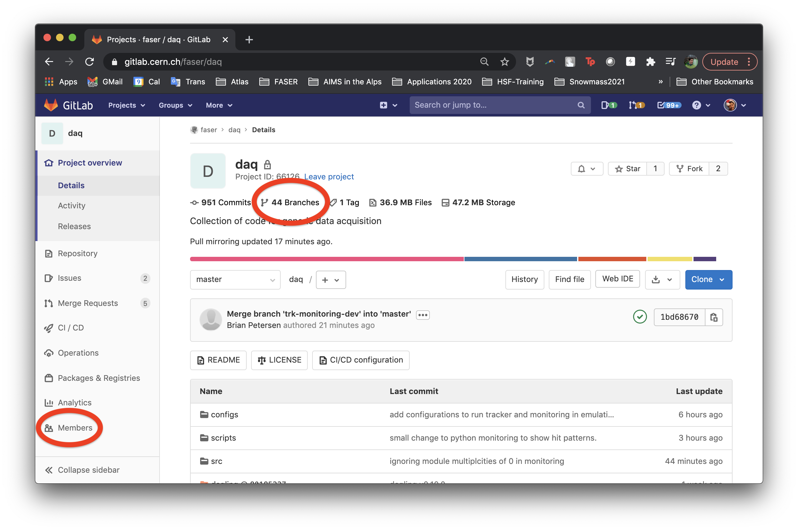
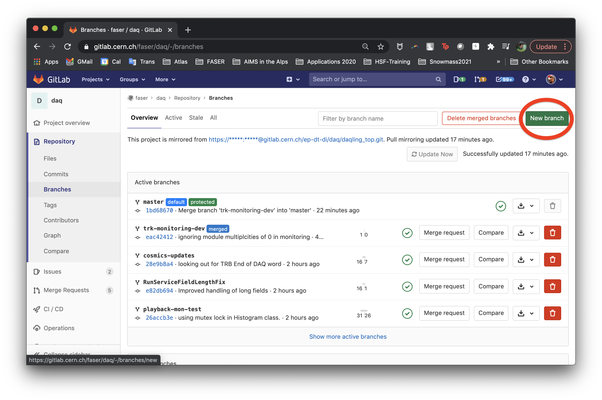
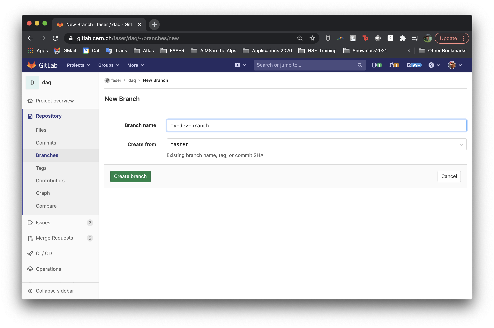
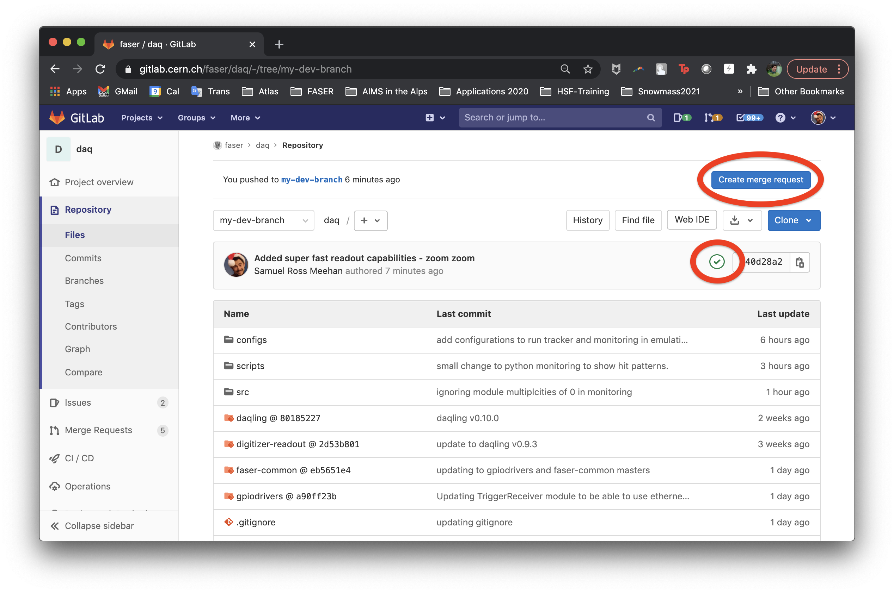
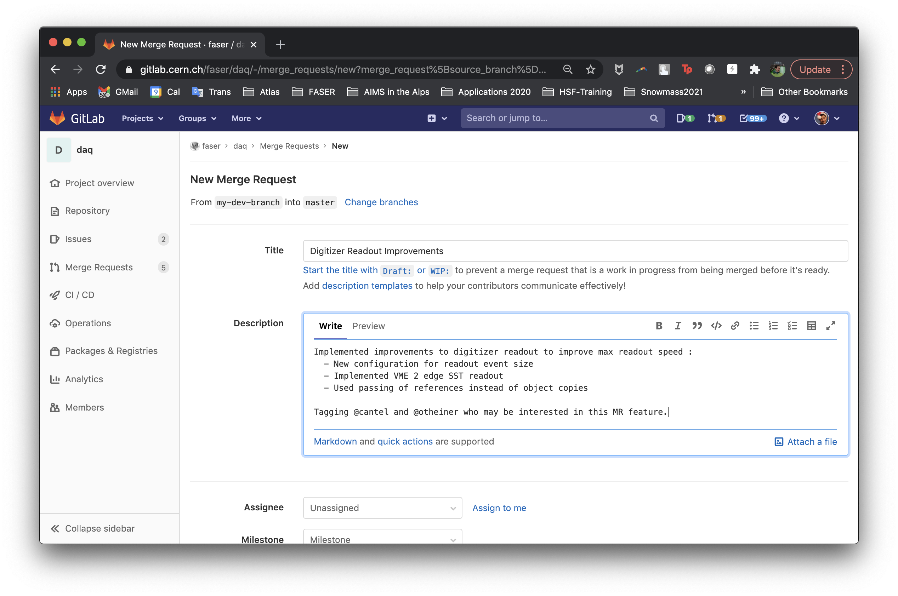
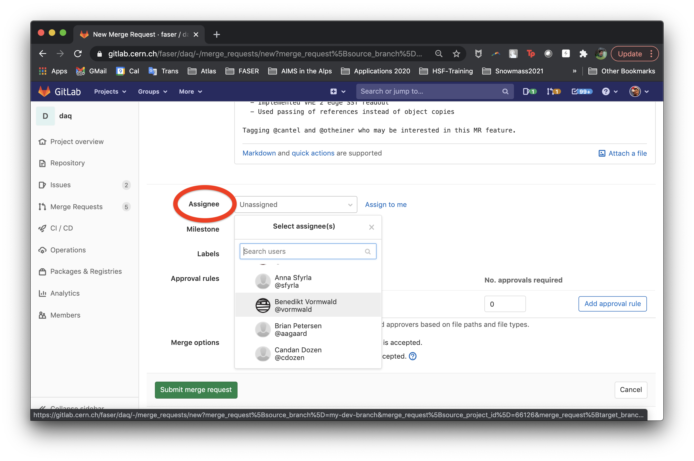
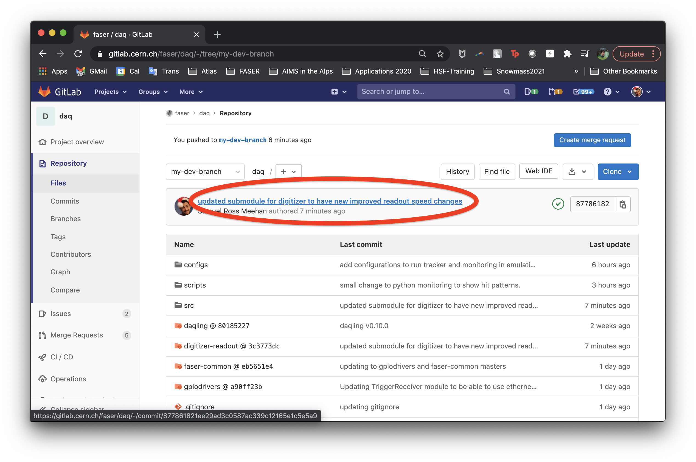
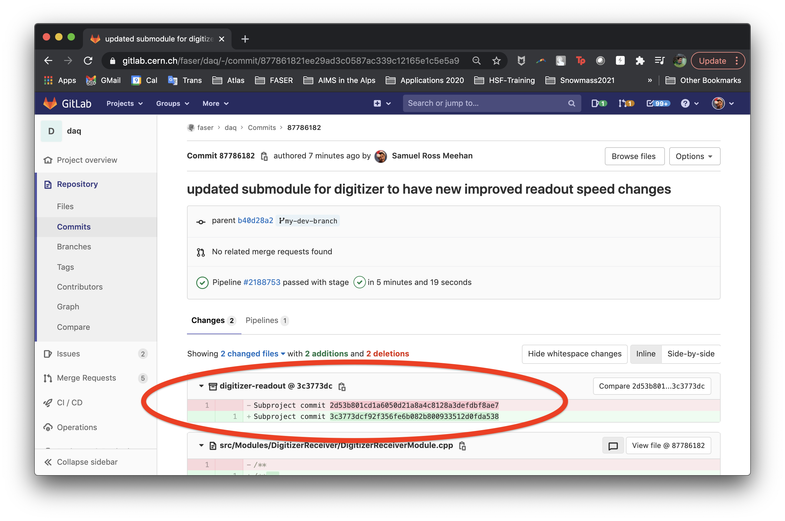

# For Developers
If you have begun using the system at anything beyond a superficial level, chances are that
you are thinking, *"Gosh, you know what would be nice in the DigitizerReceiver ..."* or *"Having 
the ability to monitor this new metric XYZ would be super useful to automatically diagnose ABC."*
And you would be right.  The system should be continually improved by input from anyone.  As such
development of any aspect of the system is very welcomed.

Described here is the changes one must make to source code to implement your desired change
and *how* you precisely get that change implemented in the [`faser/daq`](https://gitlab.cern.ch/faser/daq) (i.e. the development cycle)
is described elsewhere.

## New DAQ-ling Modules
If you find yourself in the situation where you need a new module in our system, you have
come to the right place.  This can also be enlightening for those needing to develop
new features in existing modules and need an introduction to how things fit together from 
basic perspective.

### Create Your New Module
Creating a new module is something that is not done by scratch.  Rather, start by copying 
the [src/Modules/New](https://gitlab.cern.ch/faser/daq/-/tree/master/src/Modules/New) directory
to a new space in this same `src/Modules` directory with the name of your new module (e.g. `MyModule`).

Next, you will need to go into the three files within the module directory and give it a name
by replacing the appropriate bits and pieces that still identify it as the vanilla `New` module.

__`NewModule.cpp`/`.hpp`__

  - Start by renaming these files to replace `New` with whatever you want to be your module name.
  We have decided upon a naming convention that you should adhere to when doing this : __(1)__ If the module talks to a hardware component and is intended to receive data from
  this hardware then it is a `Receiver` and you should call it `<MyModule>Receiver`.
  __(2)__ If you are creating a monitoring module, then it should end in `Monitor`.  Since
  monitoring modules roughly correspond to processing modules, you should see modules
  named as `<MyModule>Monitor`.  __(3)__ Finally, if your module is an emulator, then its name should end in `Emulator`.
  - Go into these files and modify the class names accordingly.
  - If you are constructing a new `Receiver` module, you will need to implement an entirely
  new method which is not included within the vanilla module here but is needed for FASER
  receivers.  It is the `void MyModule::sendECR()` method which will house the set of commands
  that are executed by the module upon broadcast of an [Event Counter Reset]().  The details of
  this are fleshed out below.

__CMakeLists.txt__ 

  - It may seem a bit strange, but in this file, do not change the 
  generic `module_name`, this will get automatically assigned by the naming of the directory
  and `.cpp`/`.hpp` files of your module.
  - Include the necessary CMake configuration code to build your module.  The absolute minimum
  change you will need to make is to change the name of the `.cpp` that will get built
  into your `daqling_target_source`.
  - All other modifications are module specific and may require including and linking additional
  libraries that you want your module to use.  If you are not familiar with CMake, then we 
  guide you to follow the [HEP Software Foundation tutorial on modern cmake](https://hsf-training.github.io/hsf-training-cmake-webpage/).
  However, it always possible to pick bits and pieces from other existing modules as well.

### Tailor Your Components

The `configure()` method is issued immediately upon creation of the process that is
running your module.  So just after you select a config file and click, configure.  This 
should have been apparent when running `daqpy` and the `RCGui` by examining the state transitions
and the amount of time that it takes to go through a transition.  These differ because within
this method should be all of the commands sent to the hardware that perform the actual
configuration for eventual running.  For different systems, the amount of time it takes for 
these commands to be issued may be different leading to different state transition times.
```
void MyModule::configure() {
  FaserProcess::configure();
  INFO("");
}
```
The astute reader would infer that the `start()` method is executed when a `Start` command
is issued, whether that be from `daqpy` or the `RCGui`.  And the astute reader would be correct
At this point, configurations *can* be sent to the hardware but most importantly, the single
configuration that actually kicks the hardware to begin functional acquisition should be issued.
The execution time for this method should be kept as short as possible so that starting a run
does not come with excessive overhead.
```
void MyModule::start(unsigned run_num) {
  FaserProcess::start(run_num);
  INFO("");
}
```

The `stop()` method is executed when you issue a `Stop` command.  This is where you should
clean up your hardware by sending the appropriate configurations to leave it in a
healthy state and ready for another configuration/run.
```
void MyModule::stop() {
  FaserProcess::stop();
  INFO("");
}
```


The `runner()` method is where the magic happens as this is executed when you issue a 
`Start` of the run, but after the `start()` method.  As you can see, there is
an internal look that executes so long as the `m_run` argument is true.  This is how the 
run is eventually stopped.  As such, most of your acquisition code will fall within
this while loop.
```
void MyModule::runner() noexcept {
  INFO("Running...");
  while (m_run) {
  }
  INFO("Runner stopped");
}
```

__Only in the case of receiver modules__, one must also implement the `sendECR()`
method.  This method will be executed upon the broadcast of an Event Counter Reset
and should implement the functionality that resets any hardware-based event counter
that exists within your subsystem.

```
void MyModule::sendECR() {
  FaserProcess::stop();
  INFO("");
}
```


### Linking with Ports
As a reminder, in your configurations, if you want to be able to pass data between modules
while they are running, it is necessary to link them together via the use of `sender` and
`receiver` [ports](https://en.wikipedia.org/wiki/Port_(computer_networking)) like
```
{
  "name": "Digitizer"
  ...
  "connections": {
    "senders": [
      {
        "type": "pubsub",
        "chid": 0,
        "transport": "tcp",
        "host": "*",
        "port": 8101
      }
    ]
  }
},
{
  "name": "EventBuilder"
  ...
  "connections": {
    "receivers": [
      {
        "type": "pair",
        "chid": 0,
        "transport": "tcp",
        "host": "localhost",
        "port": 8101
      }
    ]
  }
}
```
In this case, for the `Digitizer`, if data is *"sent"* to channel 0 internally, then it will 
appear in the outside world on port 8101.  Likewise, in the `EventBuilder` module, if data
is *"received"* on channel 0, then it will be the data that is currently existing on port
8101 in the outside world.  As such, these configurations have formed a link between how
we reference the data internally (via `chid`) and which data this corresponds to externally 
(via `port`).  There could be multiple mappings that exist for a given module and when 
developing our module, we only must make use of the `chid` internal reference for sending
or receiving data.

#### Sending
Sending data can only be done when the data is packaged in a specific way using the 
`daqling::utilities::Binary` format.  As such, if we start with a FASER [EventFragment](https://gitlab.cern.ch/faser/faser-common/-/blob/master/EventFormats/EventFormats/RawExampleFormat.hpp) 
(`EventFragment fragment`) then we must first transform this into this binary format 
using the utilities existing in [faser-common](https://gitlab.cern.ch/faser/faser-common) where the EventFragment is defined.  Once 
this is done, we can issue a `send()` command to the `m_connections` that naturally
exist for any process.  It is at this point that we elect onto which `chid` we wish to
place the data, via the first argument, in this case 0.

```
std::unique_ptr<const byteVector> bytestream(fragment.raw());
daqling::utilities::Binary binData(bytestream->data(),bytestream->size());
m_connections.send(0, binData);  

```

This fragment, in binary format, can now be picked up by a module downstream by retrieving
data from a `chid` that maps to the same port that this `chid` 0 mapped to.

#### Retrieving
The retrieving of data from a port is done in a similar manner, but just in reverse.
Again, the data can only be retrieved in a binary format so we need to have a binary place
(e.g. `daqling::utilities::Binary blob`) where we will be storing the data in our module.
Then, we can issue a `retrieve()` command to the `m_connections` of this module.  In this 
particular case (taken from the [EventBuilder](https://gitlab.cern.ch/faser/daq/-/blob/master/src/Modules/EventBuilderFaser/EventBuilderFaserModule.cpp#L144)).
you can see the module accessing each of the `receiver` connections in sequence, getting
the data, and transforming it back into an EventFragment.
```
daqling::utilities::Binary  blob;

for(unsigned int channel=0; channel<m_numChannels; channel++) {
  if (m_connections.receive(channel, blob)) {
    EventFragment* fragment;
    fragment = new EventFragment(blob.data<uint8_t *>(),blob.size());
    ... Do stuff with the EventFragment ...
  }
}

```
Now, how your module knows about the connections present is something that is determined
using tools that exist in the configuration parsing utilities.  As an exercise for you
to start making sense of things, go see if you can figure out how the EventBuilder module
knows how many `chid` connection to expect.

### Building

If you have setup the module appropriately, then you should be able to see if building
when you build `faser/daq` as outlined previously.  There is no top level CMake configuration
that you need to tell it about the fact that you have added a new module, it will figure
that out.

### Configuration and Your Schema

As for configuration, you will need to design an appropriate configuration file as outlined
in the previous section.  However, in addition to writing your configuration, you will also
need to design a [json schema](https://json-schema.org/) for this module.  This schema should be thought of as the
validation template against which any given configuration is compared during the configuration
step of a run to ensure it has all of the necessary parameters to perform a full configuration.
This will also function as input to the `RCGui` configuration panel to create a more user friendly
experience when trying to navigate the combined subsystem in this way.
These are stored within the [configs/schemas](https://gitlab.cern.ch/faser/daq/-/tree/master/configs/schemas) directory of `faser/daq`.

Many third party tools exist for helping to write schemas and know their contents because 
these are an industry standard and we refer the reader to use Google to find a reference 
that works best for them.  As a brief example though, in the context of FASER, it we
examine the [DigitizerReceiver configuration](https://gitlab.cern.ch/faser/daq/-/blob/master/configs/Templates/digitizer.json) `settings`
```
"settings": {
  "stats_uri": "tcp://localhost:7000",
  "influxDb_uri": "http://epdtdi-daqtest:8086/write?db=",
  "influxDb_name": "DAQlingMetrics",
  "host_pc": "192.168.122.2",
  "digitizer_hw_address":  "0x04320000",  
  "buffer": {"custom": true, "length": 630, "n_post_samples": 120},
  "trigger_acquisition": {"external": false, "software": false, "internal": true},
  "trigger_software": {"enable": false, "rate": 1},
  "trigger_internal": [{"group" : 0, "enable": 0, "logic": "OnlyA", "threshold_ch0": 8000, "threshold_ch1": 8000, "output_width":32},
                       ...
                       {"group" : 7, "enable": 0, "logic": "OR",    "threshold_ch0": 500,  "threshold_ch1": 500,  "output_width":32}],
  "trigger_internal_polarity": "over",
  "channel_readout": [{"channel": 0,  "enable": 1, "dynamic_range": 2.0,  "dc_offset": 0.0},
                      {"channel": 1,  "enable": 1, "dynamic_range": 2.0,  "dc_offset": 0.0},
                      ...
                      {"channel": 15, "enable": 1, "dynamic_range": 0.5,  "dc_offset": 0.0}],
  "readout_blt": 2000,
  "readout_method": "2ESST320FIFO",
  "interface_jumbo": true,
  "interface_max_packets": 2,
  "interface_packet_gap": 0,
  "software_buffer": 2000000,
  "print_event": false
}
```
and focus on the `trigger_internal_polarity` parameter specifically, then in the [DigitizerReceiver.schema](https://gitlab.cern.ch/faser/daq/-/blob/master/configs/schemas/DigitizerReceiver.schema),
we will see an entry like the following
```
"trigger_internal_polarity": {
  "type": "string",
  "title": "Internal Trigger Polarity",
  "description": "The direction in which the signal on a given channel must be going when it breaches the threshold set for a given channel.  This is global for all channels and so is not included in the channel trigger settings.",
  "propertyOrder": 9,
  "default": "over",
  "enum": ["over","under"]
}
```
In this case, this setting should be a string (`type`), and there are a limited number of values to choose from
(`enum`), one of which we select as a `default` value that will be pre-entered when working with the `RCGui`.  
We also include a `description` of the parameter so someone knows what its for without being an expert.  Finally
there is a `title` and `propertyOrder`, both of which are only relevant for the display on the `RCGui itself`.

__The more verbose your schema, the better the easier it will be for anyone, expert or otherwise, to use 
your module effectively, so please sink some time into developing this fully.__

## Monitoring
Within a module, implementing robust logging is essential to be able to have a view *into*
the running of the system.  Luckily, when a module exists, only a few lines of code need to
be able to save the information you want to monitor to a database for inspection elsewhere.

### Logging

In the source code, these log messages are created with calls to `INFO`/`DEBUG`/`WARNING`/`ERROR` composed as 
standard output streams to print information.
```
  // open Vme interface
  m_crate->get_vmeopen_messages(char_messages, &nof_found_devices);  
  
  INFO("Openning VME connection : ");
  INFO("get_vmeopen_messages = "<<setw(20)<<char_messages);
  INFO("nof_found_devices    = "<<setw(20)<<nof_found_devices);
    
  // set the base address of the single vx1730 card itself
  // would need to extend this in the case of multiple cards
  m_base_address = vme_base;
```

### Timed Metrics with Grafana
More details about the available features can be found in [the documentation on the espace](https://espace.cern.ch/faser-share/Shared%20Documents/Trigger,%20DAQ%20and%20DCS/FASER_Monitoring_Guide.pdf)
and provided here is only an introduction to the basic implementation of a new scalar for monitoring.

In your module header file, define the metric you wish to monitor
```
std::atomic<int> m_triggers;
```
These can be of type `int` or `float` (but refer to the document above for more details at this time).
Then, in your `MyModule::configure()` method, register the scalar 
```
void DigitizerReceiverModule::configure() {
  // register the metrics for monitoring data
  INFO("Configuring monitoring metrics");
  registerVariable(m_triggers, "TriggeredEvents");
  ...
  ...
}
```
which will save the raw counts stored in the `m_triggers` variable as the metric `TriggeredEvents` 
in the database.  As before, the precise manner in which you register a variable has options.  You can also
do things like
```
registerVariable(m_triggers, "TriggeredRate", metrics::RATE);
```
which will calculate the rate and store this quantity in the database.  So many options! Read the above document.
Be sure to initialize this scalar in your `MyModule::start()` method
```
void DigitizerReceiverModule::start(unsigned int run_num) {
  // register the metrics for monitoring data
  INFO("Initializing monitoring metrics");
  m_triggers=0;
  ...
  ...
}

```
from now on, when the process is running, this metric will be saved to the database with
the name you gave it (e.g. `TriggeredEvents`) at a regular interval which is controlled elsewhere
by the monitoring software.  So if in your `MyModule::runner()` or `MyModule::sendECR()` method
you change the value, this will be registered.

__NOTE__ : We encourage the individual who actually has to do stuff with monitoring to read
[the dedicated documentation on the espace](https://espace.cern.ch/faser-share/Shared%20Documents/Trigger,%20DAQ%20and%20DCS/FASER_Monitoring_Guide.pdf).

### Histograms and Monitoring Modules
In addition to your module monitoring individual scalar metrics of "meta"-information, it
would be nice to be able to inspect the quality of the data as it is collected by the 
system itself.  This can be done with the Monitoring modules which allow for the implementation
of not only scalar quantities, as previously described but also aggregate information
in the form of histograms.  Each monitoring module is fed the full event as assembled
by the EventBuilder and after unpacking the event and locating the relevant EventFragment,
the module can analyze the fragment and save any calculated quantity to histograms. Think
data analysis ...

In this case, a lot is done behind the scenes as all monitoring modules inherit from
the [MonitorBase](https://gitlab.cern.ch/faser/daq/-/tree/master/src/Modules/MonitorBase)
class.  Therefore, within any specific monitoring module, to implement a histogram, it is only
necessary to implement a call to `MonitorBaseModule::register_hists()` within your module. 

```
void DigitizerMonitorModule::register_hists() {
  INFO(" ... registering histograms in DigitizerMonitor ... " );
  
  // payload size
  m_histogrammanager->registerHistogram("h_digitizer_payloadsize", "payload size [bytes]", -0.5, 545.5, 275, publish_interval);
  ...
  ...
}
```
and then within the `monitor()` method, perform a call to `fill` that histogram
```
void DigitizerMonitorModule::monitor(daqling::utilities::Binary &eventBuilderBinary) {
  DEBUG("Digitizer monitoring");

  // size of fragment payload
  uint16_t payloadSize = m_fragment->payload_size(); 
  m_histogrammanager->fill("h_digitizer_payloadsize", payloadSize);
  ...
  ...
}
```
This histogram will now be available for display in "the Edward tool".

A very similar procedure exists for the implementation of additional monitoring scalar
metrics.

__NOTE__ : We encourage the individual who actually has to do stuff with monitoring to read
[the dedicated documentation on the espace](https://espace.cern.ch/faser-share/Shared%20Documents/Trigger,%20DAQ%20and%20DCS/FASER_Monitoring_Guide.pdf).

## GitLab Development Cycle
It is important that changes be tied into the `faser/daq` codebase in a timely fashion.  
At the same time, it is important that the manner in which they are included allows for
robust review to ensure that they do not break the system or cause a runtime bug.  To that
end, the manner in which changes are checked in are outlined here.  It should be recognized
that what is outlined here is not the *only* way to check in changes, but rather choices made by us.

### Continuous Integration
Continuous integration (CI) has been implemented via the use of [GitLab Pipelines](https://docs.gitlab.com/ee/ci/pipelines/) and are
configured within the [.gitlab-ci.yml](https://gitlab.cern.ch/faser/daq/-/blob/master/.gitlab-ci.yml) file.  If you are not familiar with CI, then we 
recommend that you spend an afternoon working through the [HEP Software Foundation's introductory
lesson on CICD in GitLab](https://hsf-training.github.io/hsf-training-cicd/) - it will be time
well spent.  

The CI we have runs as the `faserdaq` service account.  If you are not familiar with [CERN
Service Accounts](https://account.cern.ch/account/Management/NewAccount.aspx), then we 
encourage you to read more about them.  The credentials (i.e. password) can be obtained by
asking one of the TDAQ coordinators.

The primary thing to appreciate about this system is that if you are submitting a change.
and you get a green check mark then it means you are good to go.  On the other hand, if you
get a red X, then it means that at some stage of the CI checks (e.g. building the code)
it failed.  At this point, you should drill down to see the specific error thrown
by the CI.  You will need to fix this error before your change can be accepted.

Now, if there is an error, be wary that there are two things that may be causing this :
  
  - __CI Setup__ : This can be something like a change of the password for `faserdaq` 
  that is used for authentication or a bug in the CI configuration itself.
  - __Source Code Issues__ : These are the bugs in your code and the ones for which you are 
  truly responsible.
  
In any case, don't hesitate to ask if you are having trouble parsing the issue.

#### Local Debugging
It should be noted that the CI runs within the docker container, as outlined in the section
on [setup](setup).  As such, if there seems to be an issue with your CI and you have been 
doing all of your development on one of the dedicated machines (e.g. `faser-daq-001`)
then we encourage you to try to build your code with the docker image.

### Development Procedure
There is no single development procedure to submit a merge request within GitLab, but rather an agreed upon 
routine among those on a team.  You are free to use your own workflow, but that outlined here
is one that works for most individuals in the team and functions well with the CI.

#### faser/daq
We use branches for submitting Merge Request's (MR) to `faser/daq`.  This allows for all the active branches 
to be viewed within the same repository and for the CI to function on your branch without
having to configure the credentials in any special manner.  If you are not familiar with
git branches, we recommend you follow [this tutorial on how to use them effectively](https://learngitbranching.js.org/).

To be able to make a branch, you will need to have a role that is at least at the level
of [Developer](https://docs.gitlab.com/ee/user/permissions.html).  You can view your role
by clicking on the little `Members` button in the left-hand bar and finding your name.  If 
you are not listed or not at the right level, then you should email the TDAQ coordinators
or an `Owner` of the repository to be added.



Next, click on the `Branches` link at the top of the repo, which will bring you to a listing
of all the existing branches.  



Create a new branch by clicking the button in the upper right and select the branch from 
which you wish to create it, and what you wish to name it (e.g. `my-dev-branch` here but for you call it something more appropriate).  By default, you will create
the branch from the `master` branch and since this is the primary branch we use, this is 
probably what you will want.




Once you create a branch, you will be brought back to the main repository remote page, but
this time you are residing on `my-dev-branch`.  To start developing on this branch, you
will now need to clone and check out the branch of your choosing.
```
git clone ssh://git@gitlab.cern.ch:7999/faser/daq.git
cd daq
git checkout my-dev-branch
```
Begin making the changes and committing these to your branch and pushing them to your
repository.  Be careful about changes that you make to files within submodules of the
repository.  It may very well be that you want to develop the utilities that these bring
but this takes a two step procedure outlined below on account of submodules being
pointers to other remote repositories.  As such, __*what we are describing here is
implicitly assuming that you are really only wanting to develop or make changes to
the core modules and code directly housed within `faser/daq`*__.

Once you have made all of the changes you want to make, and your branch shows that CI
has successfully passed, you are ready to submit a MR. Click on the `Create merge request`
button to start this process.



This page should be rather self-explanatory and guide you through what to write.  It is 
important that you be verbose and explain what you are changing and why.  In addition
to verbose commit statements, this provides an even higher level change-log for the 
development of our code base.  In addition to describing the changes, flag others who may 
have a vested interest in the development.



__NOTE__ : If you are like, "Oh, but I am not 100% confident that I am finished." that is 
fine.  Append the title of your MR with the prefix `WIP:` and this will label the MR as a 
"work in progress" and highlight to anyone with rights to approve and merge the code that
you are not quite ready.  However, submitting the MR early will allow other folks to 
comment on the changes and for you to reflect on these comments during the entire course
of your development, rather than after you have sunk lots of time into a solution that
is not so great.

Finally, choose someone to act as the `Assignee`.  This is the person responsible for reviewing
the code and ultimately "signing off" on the change.  



There are numerous other options and features that can be implemented when making an MR, and
you should explore them.  This has only described the bare minimum.

#### Submodules
If you are developing a submodule (e.g. [faser-common]()) and wish to include that feature
within `faser/daq`, the development procedure is a bit more involved.  This is because unlike
the core `faser/daq` repository, submodules live elsewhere, in different remote repositories,
and we include them within the codebase through the use of submodule pointers.  If you
are unfamiliar with submodules, then we recommend that you follow [this tutorial on submodules](https://www.vogella.com/tutorials/GitSubmodules/article.html). As such, 
if your development needs necessitate changing the code within one of these submodules, you
will need to undergo two steps :

  - [1] Submit a MR and check in your changes to the remote submodule in question.  This 
  can follow any procedure you and the maintainers of that submodule want, but one option
  is the same as described above for `faser/daq`.  This will result in a remote repository
  of that submodule whose `master/HEAD` contains the changes you submitted.
  - [2] Include this updated submodule within `faser/daq` by updating that specific submodule.
  You may also subsequently need to modify the Modules or other code that is housed in the `faser/daq`
  repository itself if you have changed some interface.
  
The second step can be daunting for those not familiar with submodules, but should be rather straightforward.
Remember that the code of the submodule does not live within `faser/daq`, only a reference to 
a specific commit hash (e.g. `877861821ee29ad3c0587ac339c12165e1c5e5a9`).  So what we need to update is
this pointer.  To do so, starting from your clone of `faser/daq`, enter the submodule code directory
of the submodule you wish to update (in this case `digitizer-readout`) and checkout the 
branch or commit hash that contains the latest and greatest version of the submodule that you
want to include.  
```
Samuels-MBP:daq meehan$ cd digitizer-readout/
Samuels-MBP:digitizer-readout meehan$ git checkout readout-fix
Previous HEAD position was 2d53b80 Merge branch 'daqlingv9' into 'master'
Branch 'readout-fix' set up to track remote branch 'readout-fix' from 'origin'.
Switched to a new branch 'readout-fix'
```
When you did this, git has performed some behind the scenes magic and recognized that
this submodule has been updated.  So when you go back to `faser/daq` and see what has
changed, it recognizes that the contents of that submodule have changed.  
```
Samuels-MBP:digitizer-readout meehan$ cd ..
Samuels-MBP:daq meehan$ git status
On branch my-dev-branch
Your branch is up to date with 'origin/my-dev-branch'.

Changes not staged for commit:
  (use "git add <file>..." to update what will be committed)
  (use "git checkout -- <file>..." to discard changes in working directory)

  modified:   digitizer-readout (new commits)

no changes added to commit (use "git add" and/or "git commit -a")
Samuels-MBP:daq meehan$ git add digitizer-readout/
```
Go ahead and `commit` and `push` these to your development branch of `faser/daq`
```
Samuels-MBP:daq meehan$ git commit -m "updated submodule for digitizer to have new improved readout speed changes"
[my-dev-branch 8778618] updated submodule for digitizer to have new improved readout speed changes
 2 files changed, 2 insertions(+), 2 deletions(-)
Samuels-MBP:daq meehan$ git push
Enumerating objects: 11, done.
Counting objects: 100% (11/11), done.
Delta compression using up to 8 threads
Compressing objects: 100% (6/6), done.
Writing objects: 100% (6/6), 588 bytes | 588.00 KiB/s, done.
Total 6 (delta 4), reused 0 (delta 0)
remote: 
remote: To create a merge request for my-dev-branch, visit:
remote:   https://gitlab.cern.ch/faser/daq/-/merge_requests/new?merge_request%5Bsource_branch%5D=my-dev-branch
remote: 
To ssh://gitlab.cern.ch:7999/faser/daq.git
   b40d28a..8778618  my-dev-branch -> my-dev-branch
```
Now, if you go back to the remote and inspect the changes that you have just pushed by 
drilling down into the commit history, you will see that for the `digitizer-readout` bit
of your code, you have changed its pointer.  You don't actually see the specific code changes
and this is precisely because the only thing our remote knows about is the location of the 
submodule that it needs to go fetch upon cloning.





So, when you submit a MR to `faser/daq` after a change like this, you should see this minimal
change in the changelog.  All of the heavy lifting was already done in developing the changes
to the underlying code in the submodule.  Luckily, the CI will now be using (and testing) 
how `faser/daq` is behaving with this new submodule, so if that passes, then you are in good shape.


