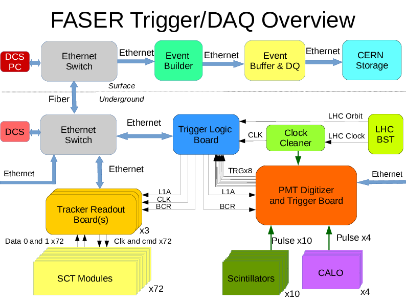

# Welcome to FASER/DAQ
Welcome! I bet you are glad to be here.  This documentation is intended to be your 
initial point of entry for getting involved in the [FASER experiment](https://faser.web.cern.ch/) TDAQ system.
It is intended to contain guidance on :

  - A high level overview of the various components of the TDAQ system and how they work 
  together during data taking
  - HowTo's for setting and running for those that don't need to develop stuff
  - Development guidance for the code itself and procedures for effectively using
  our GitLab setup

However, it does not contain detailed information concerning :

  - The Detector Control System (DCS) and how to use it
  - Detailed API documentation for the libraries of the tools used (these should be 
  documented elsewhere in the libraries themselves)
  
In addition to this documentation, other technical documents exist on the [TDAQ espace](https://espace.cern.ch/faser-share/Shared%20Documents/Forms/FASER%20topic/docsethomepage.aspx?ID=5&FolderCTID=0x0120D5200001F61BB48939BB4FA6D84AE7DEB9D12100CC5FBAF340503D4A92C34133356BCB7F&List=5e521016-7b44-4bf4-882f-29e9f7dbe2f4&RootFolder=%2Ffaser%2Dshare%2FShared%20Documents%2FTrigger%2C%20DAQ%20and%20DCS&RecSrc=%2Ffaser%2Dshare%2FShared%20Documents%2FTrigger%2C%20DAQ%20and%20DCS).

## Hardware Layout
The FASER detector has three primary active subsystems that acquire data which is 
subsequently gathered into a single event : 

  - *Tracker* : The silicon strip tracker is read out by the tracker readout board (TRB).  There are three stations.  A station has 
  three planes of trackers, each of which is read out by a single GPIO board.  In total, there 
  are nine readout boards that will record data independently.  
  - *Trigger* : The trigger logic board (TLB) is a single electronics GPIO board.
  - *Digitizer* : The digitizer records data from the calorimeters and trigger/timing/veto 
  scintillators using a single CAEN board.
  

### Trigger Logic Board (TLB)
 

### Tracker Readout Board (TRB)

### Digitizer 
The digitizer hardware is based on VME and is composed of a Struck Infrastructure Systems 
3153 (sis3153) controller board and the 16 channel CAEN vx1730 digitizer board.  
Communication with this system is performed by ethernet via the sis3153 interface board.
The low level communication drivers for the sis3153 board are provided by the manufacturer
upon which a software library has been written to provide an API for use in the DAQ 
infrastructure of modules.  

## Software Layout
The software that controls these hardware components is based on the *DAQ-ling* architecture
which orchestrates the running of individual
DAQ "processes", one for each individual board.  In addition to the external DAQ-ling 
architecture, a number of other FASER-specific software libraries are included that provide
hardware specific communication protocols (*digitizer-readout* and *gpiodrivers*) as well 
as tools shared between the online DAQ and offline reconstruction communities (*faser-common*).
All tools are included as [git submodules](https://git-scm.com/book/en/v2/Git-Tools-Submodules) 
in the [faser/daq](https://gitlab.cern.ch/faser/daq) framework.  

### [DAQ-ling](https://gitlab.cern.ch/ep-dt-di/daq/daqling)
The DAQ-ling architecture is being developed by the EP-DT-DI group and is intended to serve
as a vanilla framework to flexibly execute processes that run concurrently and communicate
between each other.  Each process is a specific instance of a "module" and can either 
control and readout a piece of hardware (e.g. [DigitizerReceiverModule](https://gitlab.cern.ch/faser/daq/-/tree/master/src/Modules/DigitizerReceiver)) or aggregate and
process data entirely in software (e.g. [EventBuilder](https://gitlab.cern.ch/faser/daq/-/tree/master/src/Modules/EventBuilderFaser)).  The generic documentation for
DAQ-ling can be found here - [daqling.docs.cern.ch](https://daqling.docs.cern.ch/).

### [faser-common](https://gitlab.cern.ch/faser/faser-common)
The faser-common library is a central location where utilities that can be shared between
online and offline communities can be developed coherently.  This includes things 
such as the [EventFormat](https://gitlab.cern.ch/faser/faser-common/-/blob/master/EventFormats/EventFormats/DAQFormats.hpp) 
and hardware payload specific fragments and decoders (e.g. [DigitizerDataFragment](https://gitlab.cern.ch/faser/faser-common/-/blob/master/EventFormats/EventFormats/DigitizerDataFragment.hpp)).
More detailed documentation of the utilities in faser-common can be
found here - [faser-common](faser-common).

### [digitizer-readout](https://gitlab.cern.ch/faser/digitizer-readout)
The digitizer-readout library provides a library that can be used to control the sis3153+vx1730
pair of VME boards and retrieve data stored upon an acquisition trigger.  This relies on
the use of faser-common for the EventFormat and is used within the [DigitizerReceiverModule](https://gitlab.cern.ch/faser/daq/-/tree/master/src/Modules/DigitizerReceiver).
More extensive documentation of this library can be found here - [digitizer-receiver](digitizer).

### [gpiodrivers](https://gitlab.cern.ch/faser/gpiodrivers)
The GPIO Drivers library provides an interface for communication with the GPIO board, which
controls the TRB and the TLB.  It also provides specific functionality necessary for operation
of each of these boards.  More extensive documentation of this library can be found here - [gpiodrivers](gpiodrivers).

## System Operation
In the fully-integrated system (shown below), the following minimal set of DAQ-ling
modules and processes are necessary for acquiring data :

  - DigitizerReceiver [1 module]
  - TriggerReceiver [1 module]
  - TrackerReceiver [9 modules]
  - EventBuilder [1 module] : This is a fully software-based module 
  - FileWriter [1 module] : This is a fully software-based module
  
More details of how this system works can be found in the [Technical Design Report](http://cds.cern.ch/record/2651328)
but in brief :

  - The digitizer provides a hardware trigger via LVDS to the __TLB__.
  - The TLB applies the look-up-table trigger stream decision and prescales and returns 
  a hardware L1 accept signal to the digitizer and the tracker boards.
  - The {__Digitizer__, __Tracker__, __Trigger__} Receivers acquire the buffered data payloads via ethernet, create
  fragments with appropriate headers from their respective hardware components and pass 
  these fragments to the EventBuilder.
  - The __EventBuilder__ composes the set of hardware fragments into a single event with event
  header and passes the event to the FileWriter.
  - The __FileWriter__ categorizes the event and writes it to disk in the appropriate output file stream.

## Contacts/Experts
If you encounter an issue, do not hesitate to get in contact with someone.  The general
email list for the group is [FASER-tdaq@cern.ch](mailto:FASER-tdaq@cern.ch) to which you
can request subscription via the CERN e-group [https://e-groups.cern.ch/](https://e-groups.cern.ch/)
portal.  Beyond this e-group, there is also an active skype channel called the "A-Team" to
which you can be added by requesting to anyone on the team.  Listed here are the specific
individuals who have particular expertise in a specific area and who you are recommended
to contact if you have issues :

  - Group Leaders/Organization : [Anna Sfyrla](mailto:Anna.Sfyrla@cern.ch), [Brian Petersen](mailto:Brian.Petersen@cern.ch)
  - DAQ-ling : [Enrico Gamberini](mailto:enrico.gamberini@cern.ch)
  - Digitizer : [Sam Meehan](mailto:samuel.meehan@cern.ch)
  - TLB : [Claire Antel](mailto:claire.antel@cern.ch)
  - TRB : [Ondrej Theiner](mailto:ondrej.theiner@cern.ch)
  - gpiodrivers : [Kristof Schmieden](mailto:Kristof.Schmieden@cern.ch)
  - faser-common : [Brian Petersen](mailto:Brian.Petersen@cern.ch)
  
## Codebase
The entry-point for the code itself is stored on the CERN instance of GitLab at
[https://gitlab.cern.ch/faser/daq](https://gitlab.cern.ch/faser/daq).  Permissions are 
controlled by individual additions of specific users and you should contact the Group 
Leaders or the repository Owner if you need a modification to your permissions.

This codebase will ultimately be made public with the [GNU Lesser General Public License](https://www.gnu.org/licenses/lgpl-3.0.en.html)
so in principle, you should have access to see everything independent of credentials, and if 
this is not the case there is a problem.

