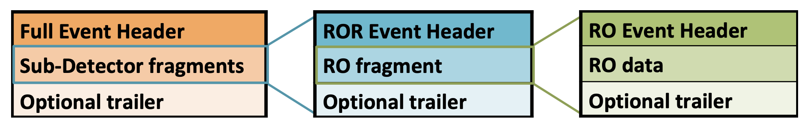

# Output Data
During the course of running, if you have included a [FileWriter]() application
and linked it to the full setup properly, `your faser/daq` setup will write output
files of the recorded data.  These are written locally, transferred to longer term storage 
on [EOS@CERN](), and subsequently reconstructed and analyzed.

## Output Files
The files that are written by the FileWriter are in binary data format and contain a 
sequence of events, each of which includes a *Full Event Header*, and a sequence
of *Sub-Detector fragments*.  Each *Sub-Detector fragment* itself is composed
of the raw *RO fragment* (Read Out fragment) payload and the FASER fragment header, specified
in [faser-common](https://gitlab.cern.ch/faser/faser-common/-/blob/master/EventFormats/EventFormats/RawExampleFormat.hpp).
Finally, each *RO fragment* is also composed of a hardware *RO data* payload with the 
*RO Event Header* from the hardware.



The location where these output files are written is specified in the configuration of
the FileWriter, as described earlier in [the documentation on configuration](./configuration).

### Storage in EOS
Ultimately, the files are to be written and transferred to EOS for long term storage.
This is currently under development and how to retrieve these files will be documented
here once complete.

## Basic Analysis

### Dumping Event Data
If you have a binary file and wish to inspect its contents, [faser-common](https://gitlab.cern.ch/faser/faser-common) includes
an [eventDump](https://gitlab.cern.ch/faser/faser-common/-/blob/master/EventFormats/apps/eventDump.cxx) script which converts the data from binary to text via the set of
decoders for each fragment type and dumps the contents to the terminal. 

If you have built the code as described in the [setup section](./setup) then you can use
the `eventDump` executable as :
```
-bash-4.2$ ./bin/eventDump ../Faser-Physics-000000-00000.raw 
Event:        1 (0x00000001)  run=0 tag=0 bc=62001 trig=0x0000 status=0x0002 time=1587033069069921 #fragments=2 payload=  1368 bytes
Event:        2 (0x00000002)  run=0 tag=0 bc=3246 trig=0x0000 status=0x0002 time=1587033069090377 #fragments=2 payload=  1368 bytes
...
```
with the optional arguments

  - `-f` : Dump the headers of the fragments for each event
  - `-d` : Dump the contents of the event fragments for the specified types.  Can take values
    - `Digitizer` : Dumps the payload and fragment header from the Digitizer fragment.
    - `TLB` : Dumps the payload and fragment header from the TLB fragment.
    - `TRB` : Dumps the payload and fragment header from the TRB fragment.
    - `All` : Dumps the payload and fragment header from *all* fragments.
  - `-n` : Specify the number of events to dump. If nothing is specified it will dump all of them.

the manner in which the data is printed depends on how the decoder is written, but ultimately
uses most (if not all) of the functionality needed and used by offline analyzers to view the 
event.  For the dumping of the Digitizer fragment, it appears as :
```
-bash-4.2$ ./bin/eventDump -f -d Digitizer ../Faser-Physics-000000-00000.raw -n 1
DumpingFragments ... 
DumpingData ...
DumpingData : Digitizer
DumpingData select systems : Digitizer
DumpingData TLB       : 0
DumpingData TRB       : 0
DumpingData Digitizer : 1
Specifying Nvents : 1
Event:        1 (0x00000001)  run=0 tag=0 bc=62001 trig=0x0000 status=0x0002 time=1587033069069921 #fragments=2 payload=  1368 bytes
 Fragment: tag=0 source=0x20000 bc=1998 status=0x0000 payload=   20 bytes
 Fragment: tag=0 source=0x40000 bc=62001 status=0x0000 payload= 1276 bytes
Digitizer data fragment:
Digitizer Fragment
        event_size:                                        13f
        board_id:                                            6
        board_fail_flag:                                     0
        pattern_trig_options:                            65280
        channel_mask:                                        1
        event_counter:                                       0
        trigger_time_tag:                               199277
      Time|     0[1]     1[0]     2[0]     3[0]     4[0]     5[0]     6[0]     7[0]     8[0]     9[0]    10[0]    11[0]    12[0]    13[0]    14[0]    15[0]
         0|     8074       -        -        -        -        -        -        -        -        -        -        -        -        -        -        - 
         1|     7687       -        -        -        -        -        -        -        -        -        -        -        -        -        -        - 
         2|     8073       -        -        -        -        -        -        -        -        -        -        -        -        -        -        - 
         3|     7689       -        -        -        -        -        -        -        -        -        -        -        -        -        -        - 
         4|     8073       -        -        -        -        -        -        -        -        -        -        -        -        -        -        - 
         5|     7685       -        -        -        -        -        -        -        -        -        -        -        -        -        -        - 
         6|     8075       -        -        -        -        -        -        -        -        -        -        -        -        -        -        - 
         7|     7685       -        -        -        -        -        -        -        -        -        -        -        -        -        -        - 
         8|     8072       -        -        -        -        -        -        -        -        -        -        -        -        -        -        - 
...
...
       625|    16383       -        -        -        -        -        -        -        -        -        -        -        -        -        -        - 
       626|    16383       -        -        -        -        -        -        -        -        -        -        -        -        -        -        - 
       627|    16383       -        -        -        -        -        -        -        -        -        -        -        -        -        -        - 
       628|    16383       -        -        -        -        -        -        -        -        -        -        -        -        -        -        - 
       629|    16383       -        -        -        -        -        -        -        -        -        -        -        -        -        -        - 
```
and you can see that for this particular run, only channel 0 was enabled for readout and was configured to have a readout window of 630.

### Event Picking
Brian Petersen has some nifty scripts that allow for more evolved presentation of the event readout 
information.  These are currently being migrated to a more stable location and once complete, their usage
will be documented here.

### EventFragment Decoders
Ultimately, the binary files that are written are done so by relying on the fragment format
specified in [faser-common](https://gitlab.cern.ch/faser/faser-common) and which is unique for each of the subsystems.  For each
type of event fragment, which itself is header-only code, there exists an event decoder
which is a set of methods that transform the binary data to useable data.  For example,
in the case of the [DigitizerDataFragment](https://gitlab.cern.ch/faser/faser-common/-/blob/master/EventFormats/EventFormats/DigitizerDataFragment.hpp).

Each of these is written with a specific event format in mind and validated in the 
continuous integration checks of faser-common.


