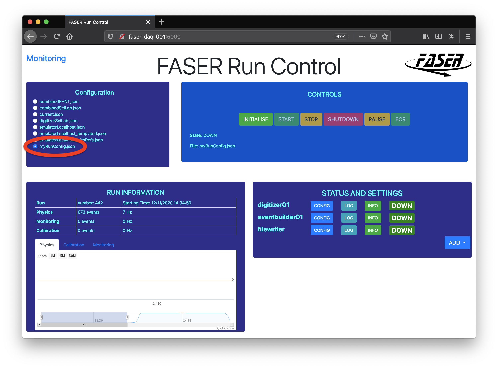
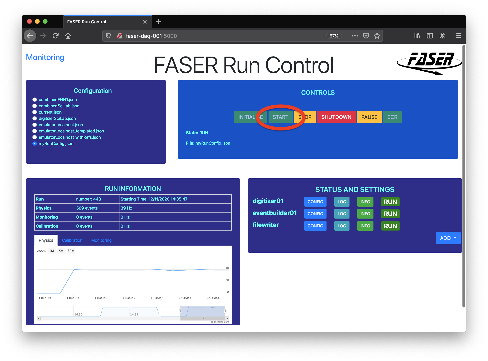
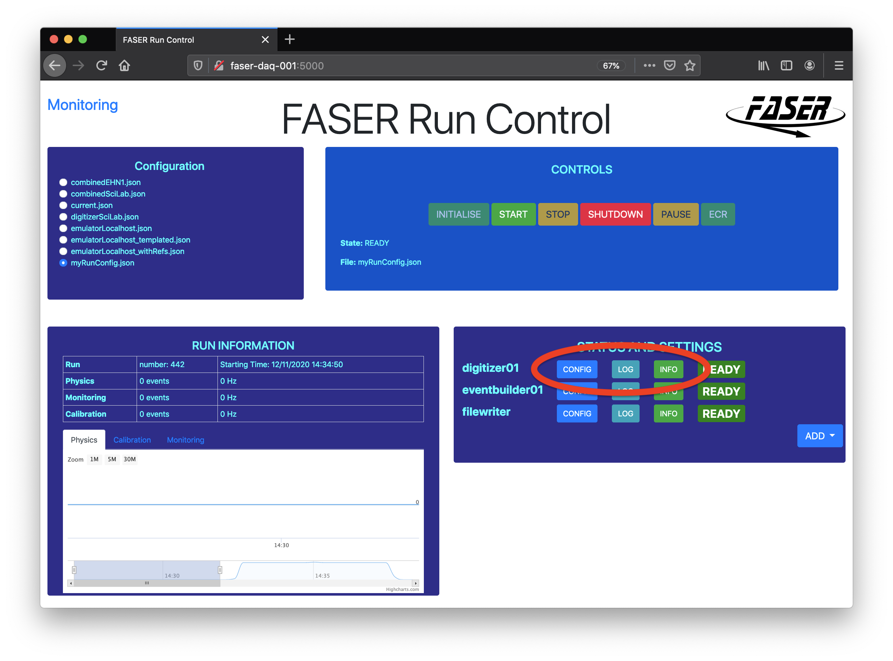
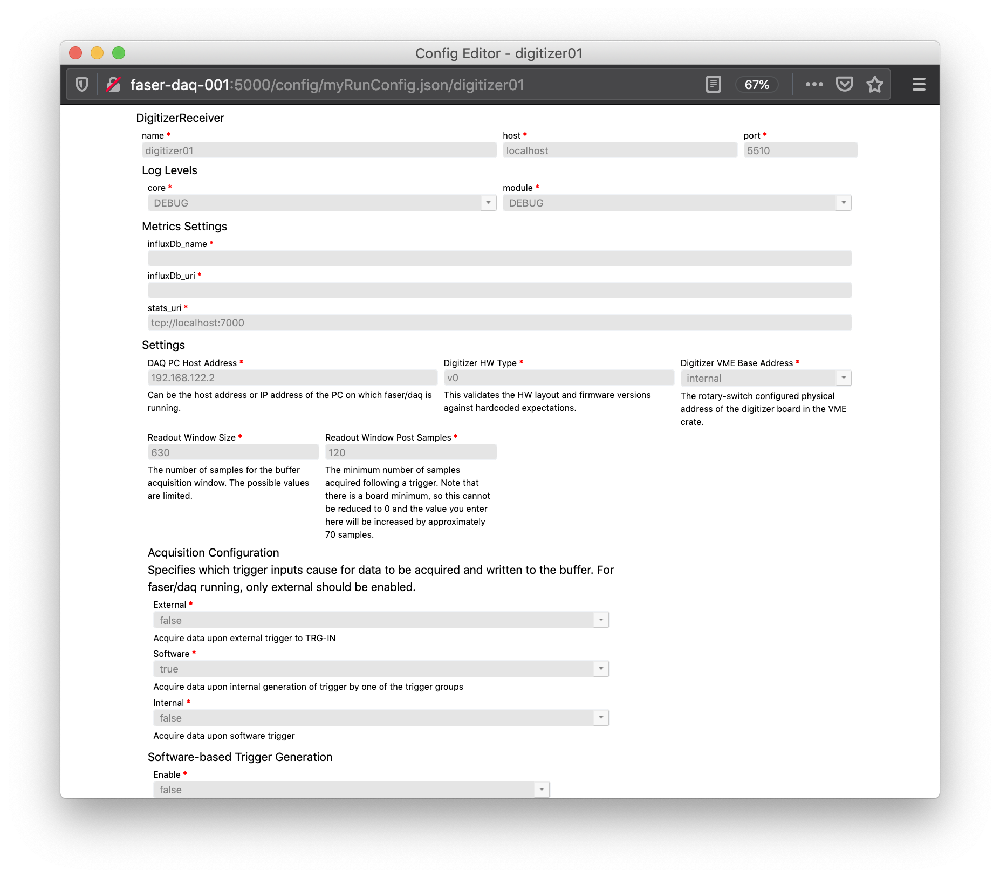
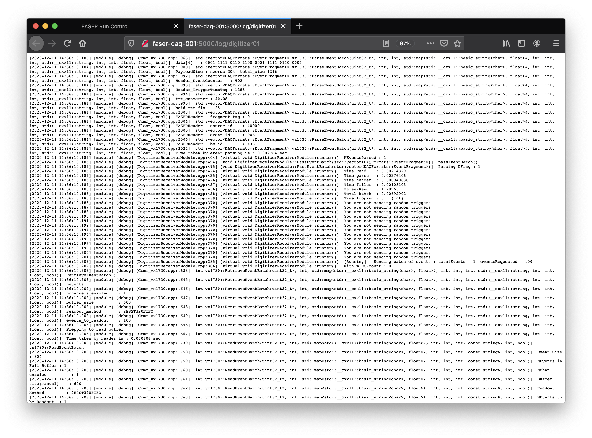
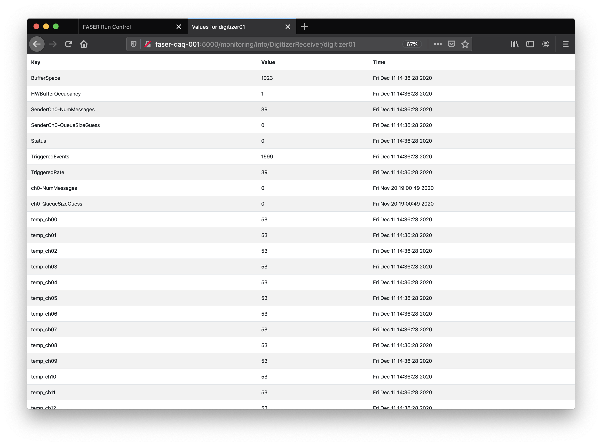
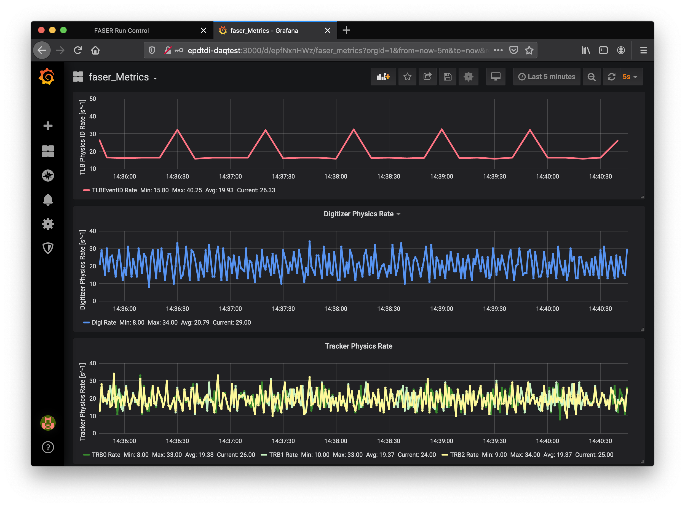
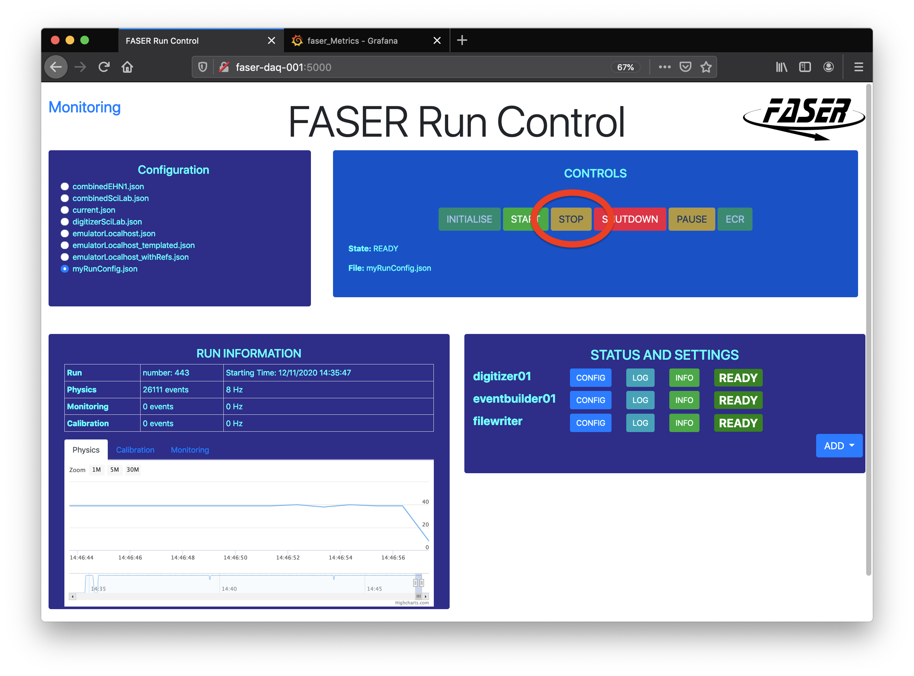

# Running the Code
If you have successfully built the `faser/daq` code, then you are ready to run it.  A run
of the faser/daq system requires as input a configuration file which contains all of the 
system specific configurations that are provided as input to the individual modules as well
as the internal "plumbing" that dictates how the modules tie together and are connected with
ports over the machines on which the processes are running.  Once you have a config file,
there are two primary ways to execute a run : (1) from the command using `daqpy` or
(2) using the Run Control GUI.

## daqpy (Command Line)
The first way to execute a run is from the command line using the `daqpy` command line 
interface, which is a utility provided by DAQ-ling.  As such, it will only be available 
*after* sourcing the `setup.sh` script in the top level `daq` directory, which you have 
probably already done in the previous step.  However, if you open up a new shell, then you 
will need to source this script again to make the CLI available.

To use this, navigate to the top level `faser/daq` directory, where you cloned the code
to, and execute the following :
```
daqpy path/to/myRunConfig.json
```
if this is successful, then you will see the modules that have been configured echo
where their log files live and indicate that they are in the `ready` state.
```
Configuration Version: 10
Using path /home/meehan/readout-fix/build/
Host: localhost 
 tail -f /log/digitizer01-meehan-20201210163553.log
Host: localhost 
 tail -f /log/eventbuilder01-meehan-20201210163553.log
Host: localhost 
 tail -f /log/filewriter-meehan-20201210163553.log
filewriter in status ready
eventbuilder01 in status ready
digitizer01 in status ready
['Success', 'Success', 'Success']
(config) | start | stop | down | command <cmd>
```
From here, you can start a run by executing the command
```
start <OptionalRunNumber>
```
which will show the transition of the modules to the `running` state
```
Executing start 123
['Success', 'Success', 'Success']
(config) | start | stop | down | command <cmd>
eventbuilder01 in status running
digitizer01 in status running
filewriter in status running
```

__*Log Files*__ : The log files that are produced are stored in the `/log` directory
as shown upon configuring the run and can be used to inspect the state of a specific
process.

__*Output Binary Data*__ : The data itself is stored at the location configured
in the  `FileWriter` module as described below.

There are a few common pitfalls where this run may fail and executing it on the command
line will allow you to see some errors that are obscured when using other methods.

### json Typo
If there is a syntax typo in your config file, then the `daqpy` call will vomit at you
and refuse to run.
```
-bash-4.2$ daqpy configs/myRunConfig.json 
Traceback (most recent call last):
  File "/home/meehan/readout-fix/daqling/scripts/Control/daq.py", line 115, in <module>
    jsonref_obj = jsonref.load(f, base_uri=base_dir_uri, loader=jsonref.JsonLoader())
  File "/usr/local/lib/python3.6/site-packages/jsonref.py", line 340, in load
    json.load(fp, **kwargs),
  File "/usr/lib64/python3.6/json/__init__.py", line 299, in load
    parse_constant=parse_constant, object_pairs_hook=object_pairs_hook, **kw)
  File "/usr/lib64/python3.6/json/__init__.py", line 354, in loads
    return _default_decoder.decode(s)
  File "/usr/lib64/python3.6/json/decoder.py", line 339, in decode
    obj, end = self.raw_decode(s, idx=_w(s, 0).end())
  File "/usr/lib64/python3.6/json/decoder.py", line 355, in raw_decode
    obj, end = self.scan_once(s, idx)
json.decoder.JSONDecodeError: Expecting ',' delimiter: line 143 column 9 (char 7096)
```

### json Schema Breach
Th `daqpy` call will parse the config file and compare it against the allowed schemas catalogued
in the [`configs/schemas`](https://gitlab.cern.ch/faser/daq/-/tree/master/configs/schemas) space.  If there is an issue with the config, it will be apparent
upon loading and should yell something at you in the terminal
```
-bash-4.2$ daqpy configs/myRunConfig.json 
Configuration Version: 10
Using path /home/meehan/readout-fix/build/
Host: localhost 
 tail -f /log/digitizer01-meehan-20201210163934.log
Host: localhost 
 tail -f /log/eventbuilder01-meehan-20201210163934.log
Host: localhost 
 tail -f /log/filewriter-meehan-20201210163934.log
eventbuilder01 in status ready
filewriter in status ready
digitizer01 in status ready
<Fault -500: 'Unexpected error executing code for particular method, detected by Xmlrpc-c method registry code.  Method did not fail; rather, it did not complete at all.  [json.exception.type_error.302] type must be number, but is null'>
[<Fault -500: 'Unexpected error executing code for particular method, detected by Xmlrpc-c method registry code.  Method did not fail; rather, it did not complete at all.  [json.exception.type_error.302] type must be number, but is null'>, 'Success', 'Success']
(config) | start | stop | down | command <cmd>
```

### Timeout
If there is a runtime error that does not manifest itself in an all out crash, then
it is possible for one of the modules not make the state transition successfully, but 
rather `timeout`.  Be sure to monitor in the terminal the state of your modules.


## Run Control GUI
The other option for executing runs is the Run Control GUI (RCGUI).  This is an 
application written specifically by FASER and not a core part of DAQ-ling.  In the future,
a DAQ-ling based run control application may replace it, but for now this serves our needs.
More detailed documentation can be found on [the espace for this application](https://espace.cern.ch/faser-share/Shared%20Documents/Trigger,%20DAQ%20and%20DCS/FASER_Run_Control_User_s_Guide.pdf).

As with the `daqpy` command line application, running this requires that you have run
the `setup.sh` command.  Furthermore, because this is a web-based application that will
be running on machines in the CERN network, it requires your connection to be within the 
CERN network, or else *you won't be able to open the web browser*.

However, the advantages to using this system for performing runs is that it gives you 
access to real-time monitoring of the run to see if you are actually taking data (e.g. Grafana)
as well as the quality of that data.

Once things are setup, configured and built for your clone of `faser/daq`, go to the top
level and execute 
```
rcgui
```
which, if successful, will show you this in the terminal
```
/home/meehan/readout-fix/scripts/Web /home/meehan/readout-fix
[2020-12-10 17:07:57,028] INFO in flask_scss: Pyscss loaded!
[2020-12-10 17:07:57,042] INFO in statetracker: runState: {'fileName': 'emulatorLocalhost_templated.json'}
[2020-12-10 17:07:57,043] INFO in statetracker: Running with: emulatorLocalhost_templated.json
Connect browser to:
 http://faser-daq-001:5000
 - If connection does not work make sure browser runs on computer on CERN network
   and that firewall is open for the port:
   > sudo firewall-cmd --list-ports
 * Running on http://0.0.0.0:5000/ (Press CTRL+C to quit)
[2020-12-10 17:07:57,207] INFO in statetracker: Status changed to: DOWN

```
you can then follow its guidance to access the webpage `http://faser-daq-001:5000`.

Here we highlight the core features for executing a run of the system.  Note that the 
screencaptures were taken for two different runs (Exercise to the Reader : See if you can 
figure out how to spot this) but highlight the core features.

### Choose a Config
Start by selecting the configuration file you wish to configure the run to use.



### Start a Run
Begin by running the `Initialize` for the run.  This is equivalent to executing the initial
`daqpy` call and will boot up all of the processes in your configuration and initialize them.


When all of the modules have transitioned to `Ready` then you can `Start` the run.  In this 
case, the run number is selected automatically.  You will see the modules transition from `Ready`
to `Running` and if your system is configured appropriately and there are inputs to the 
hardware generating acquisition triggers, then you will see the rate of events as
monitored by the EventBuilder.  This is the first example of very basic monitoring that 
can make the RCGUI considerably more advantageous for performing runs.



### Inspect the Configs/Logs
The log files, while stored in the same locations, can now be accessed in the web browser 
by navigating to them for a specific module.  It is also possible to inspect the configuration
settings for that specific module which have been taken from the json config file.










### Monitor the Run with Grafana
Finally, the RCGUI provides a portal by which one can access the [Grafana]() monitoring
portal which parses the database of monitoring metrics.  More on monitoring applications
is presented elsewhere in this document but consider exploring it at this point anyways.




The actual instance of grafana is running
on `http://epdtdi-daqtest:3000` which means that this is the node which will be accessed
to view the monitoring and this link is nothing more than redirecting you there.  If you would like
to monitor an ongoing run, you can connect directly to this node.
If this prompts you for a username and password, they are both `admin` at the moment.  This
should be improved in the future ...

### Ending the Run
When you have taken enough data or done whatever else it is that you wanted to do with 
your run, it is time to stop it.  This is done by going through two transitions : (1) `Stop`
and (2) `Shutdown` in that order.  This is executed by pressing the two buttons that say
this.  It is important to go through both of these transitions to ensure that the system
is left in a healthy state.




### Additional Buttons
The astute reader will recognize that two buttons have not been used here.  

  - `Pause` : This pauses the run so no triggers will be acquired but the hardware will 
  persist in the `READY` state, therefore configured.
  - `SendECR` : This sends an Event Counter Reset (ECR) which sets the subsystem hardware 
  counters to zero.
  

