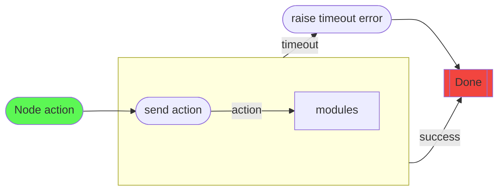
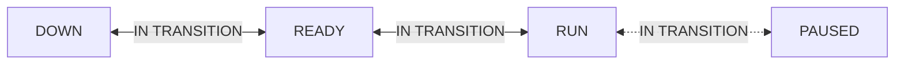
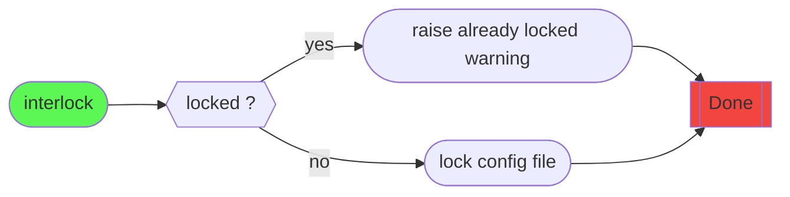
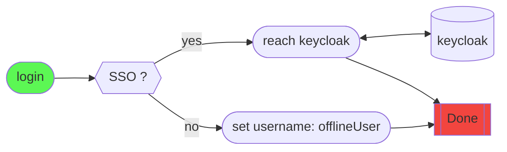

# Run Control Web GUI 

## What’s new

In the new version, daqling allows to view the data acquisition system as a tree with nodes (equivalent to modules for the use of DaQling by FASER (FIXME). Some nodes have children (leaves). Contrary to the previous version, it is possible to control independently the different modules by choosing an action to send to a specific module (now and after, the term action will be used to designate the commands sent to a node, contrary to the "Root commands" which will be specific commands to FASER and the Run Control GUI).


The actions sent will be transmitted to all children nodes that are `included`. A node can also be `excluded`.
> Excluded nodes will not participate to the parent's status and will not receive commands from the parent node.

*(Daqling documentation)*

In addition to the `included`/`excluded` flag, a node also has an `inconsistent` flag: 
> Inconsistent `[ True / False ]`. If the children of a node are in different state, the `inconsistent` flag is raised.

*(Daqling documentation)*

Each state of the FSM can be navigated, as described in graph below : 

```mermaid
flowchart LR

s1[not_added]
s2[added]
s3[booted]
s4[ready]
s5[running]
s6([paused])

s1--> |add| s2 --> |boot| s3 --> |configure| s4 --> |start| s5 .-> |disableTrigger| s6
s6 .-> |enableTrigger| s5--> |stop| s4 --> |unconfigure| s3 --> |shutdown| s2 --> |remove| s1
s6.-> |ECR| s6
```
*The dashed and rounded elements are FASER specific.*

Instead of having only one configuration file, now a configuration setup needs 4 configuration files, one of which must not change between the different configurations : 

- <nameofconfig>.json : the current config file.
- control-tree.json : the tree structure of the configuration. 
- fsm-rules.json : the possible states and order of starting and stopping  modules (should not change between configurations) 
- config-dict.json : paths of above configuration files. 

`fsm-rules.json` and <nameofconfig>.json can be in the `faser-daq/configs` directory, but a valid configuration needs to have a folder with the name of the configuration and inside it, a `config-dict.json`. 

For more informations, see``daqling` documentation [link] (https://gitlab.cern.ch/ep-dt-di/daq/daqling/-/blob/master/README.md).

## Installation
### DAQ servers
Clone the project from Gitlab :
```bash
git clone --recurse-submodules https://gitlab.cern.ch/faser/online/faser-daq.git
cd faser-daq
git submodule init
git submodule update
```
Latest version of daqling Latest version of daqling is not compatible with spack, or at least, I didn’t find the configuration file. We change to daqling v1.0.3 (otherwise, you have the `No config file - Exiting. error`). 
```bash
cd daqling
git checkout v1.0.3
```

Return to the faser-daq folder and build the project:
```bash
source setup.sh /home/daqling-spack-repo/
mkdir build
cd build
cmake ../
make -j4
```
Change to the run-control-gui git branch:
```sh
git checkout run-control-gui
```
Create a new python environment and install the necessary python packages: 
```bash
cd faser-daq/scripts/RunControl
python3 -m venv venv
source venv/bin/activate

pip install zmq async_generator contextvars flask_socketio anytree jsonref redis flask flask_cors
```
The Run Control GUI needs keycloak for authentification. The current keycloak version available with pip require python 3.7 minimum, but we are working with python 3.6. One way to make it work is to build the package ourself. 
```bash
% Go to the daqling folder
cd daqling 
source cmake/setup.sh
git clone https://github.com/keycloak-client/keycloak-client.git
cd keycloak-client
pip install --upgrade pip 
make install
```
Now we go to  `faser-daq/scripts/RunControl/` and launch the app:

```bash
source setup.sh 
./run.sh
```

To use the keycloak authentification, it is necessary to have a secret token. To have it, you have to create a new application at the CERN Application Portal.

## Migrating to new Run Control
By default, the existing configurations will not appear in the new RunControl, because the other configuration files are needed. Since adapting them by hand would be long and tedious, it is possible to use a script that allows, from an existing configuration file, to create a folder with the same name, with inside the `config-dict.json` and the associated `control-tree.json`, assuming that the fsm-rules.json file is in the configurations folder. It is possible to tweak afterwards the `control-tree.json` for more customization.  

The script is located at https://gitlab.cern.ch/faser/online/faser-daq/-/tree/run-control-gui/scripts/RunControl and it is used as follow (python environment have to be activated) :

```bash
python createControlTreeConfig.py <pathToExistingConfigFile> <pathToOutputDir>
```

## Interface

### Tree View 

On the left side is the treeview, where the structure of the control tree, extracted from the json file, is visualized.
For each node, its state is displayed as a color code:
- not_added : grey
- added : brown
- booted : blue
- ready : yellow
- running : green
- paused : orange

It is also possible to hover over the color with the mouse to display the status.

When the daq system is in the general state "DOWN" it is also possible to include/exclude the node by means of the checkbox next to the node name. In all other general states this option is not available.

When errors occur in nodes, an icon appears next to the node name and in the parent nodes. 
The colors for the errors correspond to different status of the module:

- orange : status = 1
- red : status = 2 

If there is at least one error in any node, the same icon appears at the top of the page.
Also, when a node is not in the same state as its parent node and the general state is not `IN TRANSITION`, an error for that module will be raised. 
The treeview can be entirely collapsed.


### Configuration selection

The configurations displayed in the dropdown are taken from the folder specified by the `DAQ_CONFIG_DIR` environment variable.

In addition, only folders containing a file named "config-dict.json" will appear in the dropdown.

### Actions buttons 

If really needed, the actions provided by the FSM can be directly applied to a node. To do this, simply select the desired node in the treeview. This will bring up the action buttons below the root commands. 

The action buttons should only be used as a last resort, the root commands are preferable in any case. 



### Root commands

Commands that will only be applied to the "root" node, so to all modules, no matter which module is selected. They should be seen as generalized commands. These are the commands to use to control the daq system. 


The root commands allow access to the different general states of the Run Control. 



The following commands can be performed:

#### Initialise
*Allows you to get into the general state `READY`*.

Will perform the `add` and `configure` actions in this order on all modules (the `boot` command is done automatically by *daqling* and *supervisor* and takes place between the `add` and `configure` actions. This behavior can be modified [here](https://gitlab.cern.ch/ep-dt-di/daq/daqling/-/blob/master/scripts/Control/supervisor_wrapper.py#L59))

The command has a timeout, so if after 30 seconds all modules have not reached the `ready` state, (so the root node is in the `ready` state and is not inconsistent), the command is aborted. 

    
#### Start
*Allows to launch the experiment*.
The command displays a window, allowing to define the run type and a comment (mandatory).
The information will be sent to the run service server, which will record this information and return the run number.
Once done, the `start` action will be sent to all modules.
Timeout: 30 seconds

<u>Note</u>: If we start the application with the `-l` argument, the run service server will not be used and the run will not be recorded (useful for testing). The resulting run number is 1000000000.

#### Stop
*Allows you to stop the experiment*.
A dialog box appears, allowing you to specify the type of run if you have not already done so or if the type was wrong, as well as a comment at the end of the run. The information will be sent to the run service server for archiving. 
Then the `stop` action will be sent to all modules. 
Timeout: 30 seconds.

<u>Note</u>: If we start the application with the `-l` argument, the application will not communicate with the run service server.

#### Shutdown
*Allows you to get into the general `DOWN` state. 
It will perform the following actions in order: `unconfigure`, `shutdown` and `remove`.
If the timeout is exceeded (usually there is a problem), the `unconfigure` and `shutdown` steps will be skipped and only the `remove` action will be performed. 

<u>Note:</u> The `Shutdown` command is always accessible because it is the one that should be run when modules have errors. 

#### Pause

*Allows you to set the general state to `PAUSED`*.
The command will send the `disableTrigger` action to all modules, but the unaffected modules will ignore it and simply set themselves to `paused` state.


#### Resume
*Allows the experiment to be switched back to the `RUN` state after being in the `PAUSED` state*.

The command will send the `enableTrigger` action to all modules, but the unaffected modules will ignore it and simply return to the `running` state.

#### ECR
*Allows you to reset the counters*.
Accessible only in `PAUSED` state, the command sends the `ECR` action to all modules. This command does not change the general state and remains in `PAUSED` state.

[![](https://mermaid.ink/img/pako:eNqVVc1u2zgQfhVCBQoHaAqT-rEjFF2gzR720gW66UnygZEomViJNEiq3cDKsW-yb9YX6ZC0bCqOW8QHQ_Ojme_7Zkjto0rWLMqjppPfqi1VBt19KEUpBF4Un6U06KPseyrqzVWe59pAAsRIsVCs5vpqA0a83--UrJjWU-7jI7iTxeLH9_-vrlyxbFFoJmpEK8Ol2IBTrIpe1kPHtK2xXhSKcs2Q4T2Tg0FMKalc3s1-38mKdlJ0D-gPVxovF0XLDFKD-DT098wnYgyoBoE0U195xRw2TM4b4zjsjJPLrXF61ruWghXFLfxvNk4QufNqoevr92hk_xnoxmrEhWEK3v13RIKc4pUXaBSxFQ5812jkghtOO4AwisQK51OhtGKok61GO2q2oyvjYyKzPfVw3yq626IWo2ICn6N4CQpUQA3Br-aKOeZuqtYjMl-e1oBihebOSoqGt4MCJCsfATalaA_o9VDZMY9WBO99C_gPrUextlk-ZtmBMbqFGcWNnaO1hRxhJpP1wDSYSy_gEjw-hpfvbLSM_vqUI_OwY69dGWTFY8Kgv7_c5afZlxHUwLZGKAl5iSSYBFhxHDAHluRZ7uQJd-wnc2T_zOpMisgdpKc-C84FDMKSgY1p5GHrTtpkLsnakxboNbIlJjEm7gKvntn0dbDpJ23iF2mzClCvA2k8Loj79jcXj1Hrec_1i0G-QL2bmXqTVjs62ENBliH65CXoyfJMFe_HgTKHTNsR7jR637E7xduWKWiNZ8sgCLlMMwFKwMQ9PT0Hiumht1TikEr6IirxBSrJGRXXkok5k2QWPQJK5tueWhKEuKcTiTMaaUgjC2mQ37BIL7DIzli4YzCI4E4i2Symt4Op5TdxFlCsl1-D_AO5EPMKFWXUSFUxNJUpo1_AXl2AvZ7BPmbPUKznEmfu6mjduQEc4a4QcrTabKZ_KaqOan3LGuQvw4Z3Xf4qrZpVmsyCcDf4WEOSNG78y9GbqGeqp7yGT_3eQY3MlvWsjHJ47Hi7NWVUikdIHHY1NezPmsMHKMob2mn2JqKDkf88iOro8Fm3nIKg_cH7-BPUl8zt)](https://mermaid.live/edit#pako:eNqVVc1u2zgQfhVCBQoHaAqT-rEjFF2gzR720gW66UnygZEomViJNEiq3cDKsW-yb9YX6ZC0bCqOW8QHQ_Ojme_7Zkjto0rWLMqjppPfqi1VBt19KEUpBF4Un6U06KPseyrqzVWe59pAAsRIsVCs5vpqA0a83--UrJjWU-7jI7iTxeLH9_-vrlyxbFFoJmpEK8Ol2IBTrIpe1kPHtK2xXhSKcs2Q4T2Tg0FMKalc3s1-38mKdlJ0D-gPVxovF0XLDFKD-DT098wnYgyoBoE0U195xRw2TM4b4zjsjJPLrXF61ruWghXFLfxvNk4QufNqoevr92hk_xnoxmrEhWEK3v13RIKc4pUXaBSxFQ5812jkghtOO4AwisQK51OhtGKok61GO2q2oyvjYyKzPfVw3yq626IWo2ICn6N4CQpUQA3Br-aKOeZuqtYjMl-e1oBihebOSoqGt4MCJCsfATalaA_o9VDZMY9WBO99C_gPrUextlk-ZtmBMbqFGcWNnaO1hRxhJpP1wDSYSy_gEjw-hpfvbLSM_vqUI_OwY69dGWTFY8Kgv7_c5afZlxHUwLZGKAl5iSSYBFhxHDAHluRZ7uQJd-wnc2T_zOpMisgdpKc-C84FDMKSgY1p5GHrTtpkLsnakxboNbIlJjEm7gKvntn0dbDpJ23iF2mzClCvA2k8Loj79jcXj1Hrec_1i0G-QL2bmXqTVjs62ENBliH65CXoyfJMFe_HgTKHTNsR7jR637E7xduWKWiNZ8sgCLlMMwFKwMQ9PT0Hiumht1TikEr6IirxBSrJGRXXkok5k2QWPQJK5tueWhKEuKcTiTMaaUgjC2mQ37BIL7DIzli4YzCI4E4i2Symt4Op5TdxFlCsl1-D_AO5EPMKFWXUSFUxNJUpo1_AXl2AvZ7BPmbPUKznEmfu6mjduQEc4a4QcrTabKZ_KaqOan3LGuQvw4Z3Xf4qrZpVmsyCcDf4WEOSNG78y9GbqGeqp7yGT_3eQY3MlvWsjHJ47Hi7NWVUikdIHHY1NezPmsMHKMob2mn2JqKDkf88iOro8Fm3nIKg_cH7-BPUl8zt)


### Log and info panels

It is possible to access the Run Control GUI logs, the logs and metrics of each module. 

When reloading the page, only the first 20 entries of the application logs are displayed. To access the entire log, the file is located at the location specified in the `serverconfiguration.json`.

To access the logs of each module, you must first select the module in the treeview and then click on the `log` button. Two options are available :
- full log : all the log for a run is displayed, but you have to refresh the page to get the last updates. 
- live log: directly provided by supervisor, the display, it is updated live, but only the last lines of the log are displayed.


The live information for each module can be displayed after selecting a module in the treeview and clicking the "info" button. The information can also be displayed in a separate window by clicking on the icon in the upper right corner.


### Login and interlock

To perform actions on the daq system, you must log in with your CERN account by clicking on the silhouette icon in the upper right corner, and only then take control of the system by clicking on the lock icon. 

The CERN nickname will appear at the top next to the interlock icon.
Only **one** person at a time can take control of the system.

Interlock has a timeout that is extended by the same amount of time if any action is taken on the system.



### Monitoring

On the monitoring panel, it is possible to see some live metrics of the eventbuilder module as well as time series plots of physics, calibration and monitoring events. 

Note: if the timeseries plots feels too cluttered, just reload the page.


